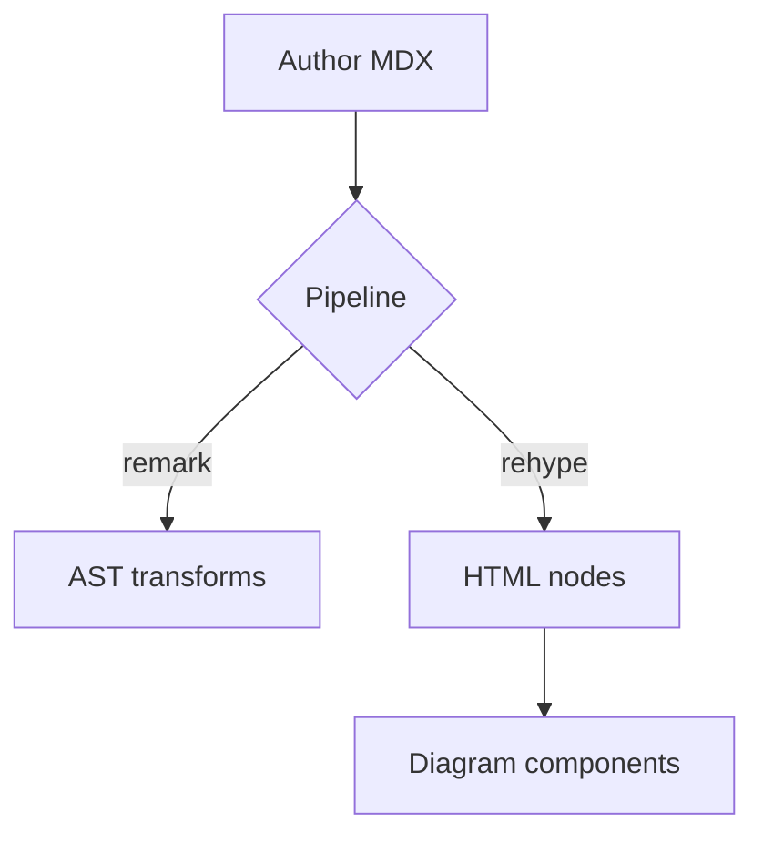
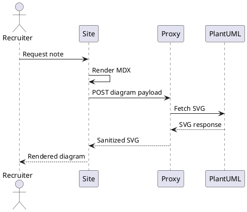

## Why MDX powers the notes section

Recruiters and engineering leaders need more than a resume bullet. MDX lets longer-form notes mix prose,
callouts, and runnable snippets without dragging a CMS into the stack. The pipeline keeps frontmatter typed,
headings linkable, and renders identical in the app and RSS.

## Rendering flow

| Stage | Responsibility | Output |
| ----- | -------------- | ------ |
| Parse | Gray matter lifts frontmatter and raw markdown. | `{ content, data }` |
| Compile | `compileMDX` applies remark/rehype plugins. | React component |
| Present | Layout components inject ToC, metadata, and theme-aware styling. | Page-ready tree |

```ts title="apps/site/src/lib/mdx.ts"
import { compileMDX } from "next-mdx-remote/rsc";
import remarkGfm from "remark-gfm";
import rehypeSlug from "rehype-slug";

export async function renderNote(source: string) {
  const { content } = await compileMDX({
    source,
    options: {
      parseFrontmatter: true,
      mdxOptions: {
        remarkPlugins: [remarkGfm],
        rehypePlugins: [rehypeSlug]
      }
    }
  });

  return content;
}
```

## Linking strategy

- Every heading generates an anchored slug for deep links.
- Tables get responsive scroll wrappers so horizontal content stays readable.
- Code blocks inherit code titles compiled by `remark-code-titles` for context.





## Next enhancements

- Surface `estimatedReadingTime` in the list view.
- Pipe frontmatter through an RSS feed so subscribers stay in sync.
- Add localized summaries per note once translated copies land.
